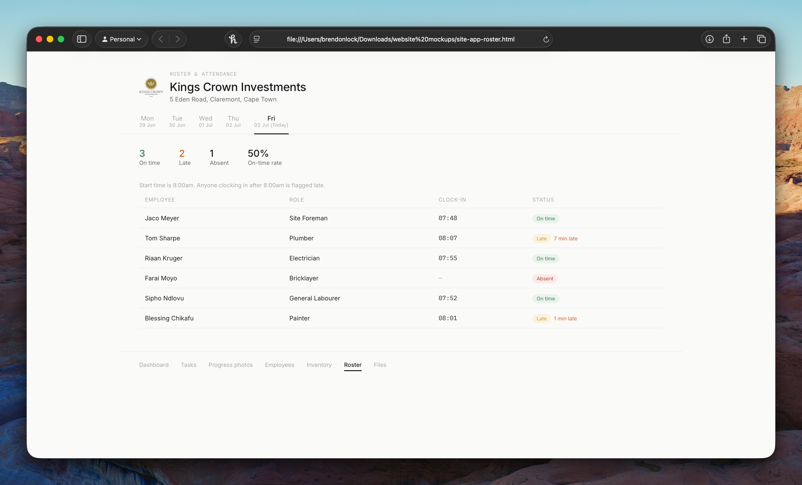
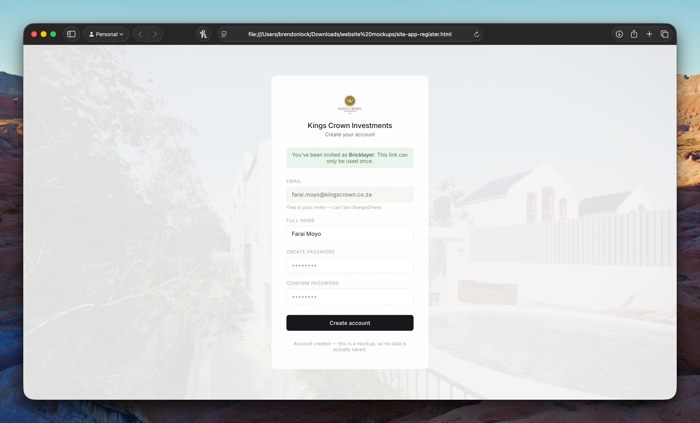

# Construction Site Manager 

## Overview
This project contains the initial HTML mockups developed for a property investment client. The dashboard was specifically designed to help the client track tasks, manage personnel, and oversee various aspects related to the daily operations of their construction business.

## Future Plans

While currently existing as custom HTML mockups for a single client, active work is being done to evolve this concept into a comprehensive, multi-tenant application. The goal is to build a scalable platform that allows various construction and property management companies to utilize the tool for their own site management needs.

This platform will consist of tools/promts to use in Claude AI for companies to use, to help create and customise the platform to their preferences.

### Demo Images

